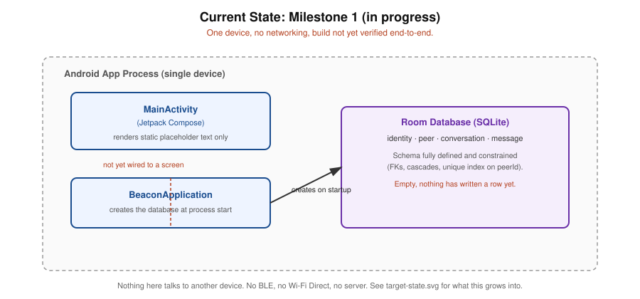
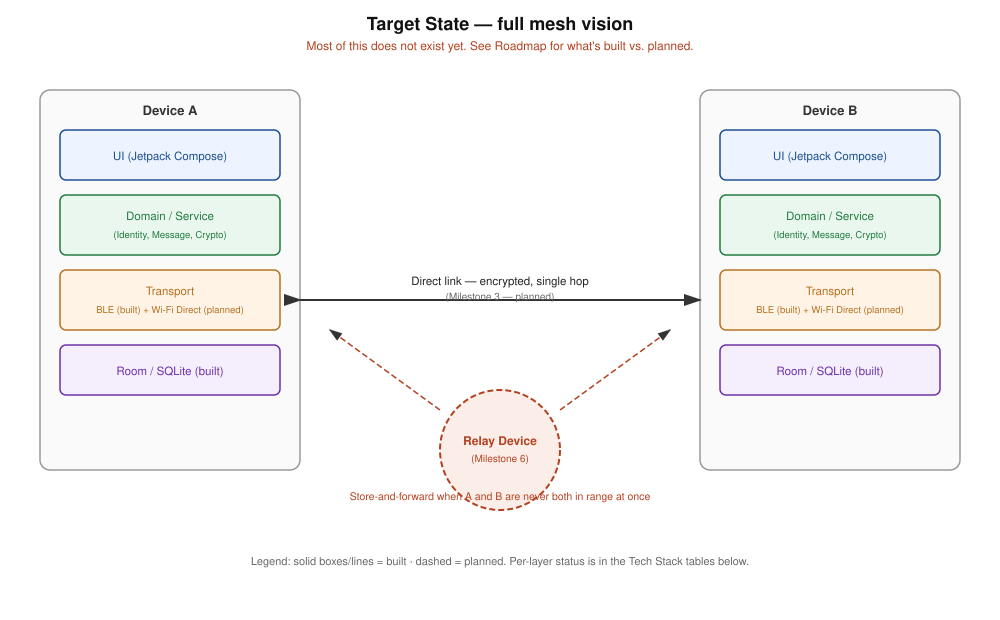

<div align="center">

# Beacon

**Offline-first, encrypted mesh messaging over Bluetooth LE — for when the internet isn't there.**

[](android/app/build.gradle.kts)
[](android/app/build.gradle.kts)
[](android/app/src/main/java/com/beacon/data/BeaconDatabase.kt)
[](#roadmap)

</div>

Beacon is a peer-to-peer messenger for places the internet doesn't reach — disaster response, remote expeditions, dense events where cell towers exist but are saturated. Two nearby phones discover each other and exchange messages directly over Bluetooth LE, with no server, no account, and no cellular or Wi-Fi infrastructure required. The offline-first architecture — local-first persistence, a real message delivery state machine, hardware-backed identity keys — exists to serve that product requirement, not because distributed systems are interesting in the abstract: every engineering decision here traces back to a concrete situation where connectivity fails and communication still has to work.

## Why this project exists

Modern messaging assumes a live path to a server. That assumption breaks exactly when communication matters most: towers down after a disaster, no coverage on an expedition, towers up but overloaded at a packed event. Beacon starts from the opposite assumption — two devices near each other should be able to talk regardless of what infrastructure exists between them.

Full problem statement, target users, and the reasoning behind the transport/topology choices: **[docs/00-foundations.md](docs/00-foundations.md)**.

## Engineering approach

Principles this build has actually practiced so far, each checkable against the repo:

- **Every architecture and technology decision is logged before code is written for it** — what was chosen, what else was considered, and why the alternative lost. See [docs/architecture/](docs/architecture/) (ADRs 0001–0004).
- **Domain rules are enforced at the database layer, not just in application code.** "One conversation per peer" isn't a convention application code has to remember — it's a `UNIQUE` index in the schema ([`Conversation.kt`](android/app/src/main/java/com/beacon/data/Conversation.kt)) that rejects violations outright.
- **Deferred and rejected scope is written down explicitly, not silently absent.** See the "Deliberately deferred" section of [docs/02-milestone-1-domain-and-persistence.md](docs/02-milestone-1-domain-and-persistence.md) and the non-goals in [docs/00-foundations.md](docs/00-foundations.md).
- **No invented metrics.** There are no performance or reliability numbers anywhere in this repo. Any that appear later will be backed by an actual benchmark, not a plausible-sounding guess.
- **Documented reasoning follows problem → naive approach → why it breaks → the actual fix**, not just "we chose X." Visible throughout the milestone docs and ADRs — e.g. why `ByteArray` was rejected for stored public keys in favor of Base64 `String`, documented in the [`Identity.kt` design note](docs/02-milestone-1-domain-and-persistence.md#3-schema).

## What's actually working right now

- **The full Milestone 1 domain model is implemented as Room entities and DAOs** — `Identity`, `Peer`, `Conversation`, `Message`, with foreign keys, cascading deletes, and the unique-per-peer conversation constraint described above. Code: [`android/app/src/main/java/com/beacon/data/`](android/app/src/main/java/com/beacon/data/).
- **Journey 1 (first launch & identity creation) is implemented and verified end-to-end on a running emulator (Pixel 8, API 34), 2026-09-01**: `MainActivity` observes the `Identity` table and shows a display-name setup screen when none exists; submitting it generates a hardware-backed EC keypair in the Android Keystore ([`IdentityKeyStore`](android/app/src/main/java/com/beacon/crypto/IdentityKeyStore.kt)) and persists the resulting `Identity` row via [`IdentityRepository`](android/app/src/main/java/com/beacon/data/IdentityRepository.kt) — the private key never leaves the Keystore. Once an identity exists, the reactive UI switches to an empty "Nearby" screen (Milestone 2's job to fill in) with no manual navigation code involved — confirmed by actually running it, not just reading the code.
- **The Android project scaffold is written** — Gradle (Kotlin DSL), Jetpack Compose, Room + KSP.
- **Journey 5 (returning to the app later) is verified too**: stopping and relaunching the app goes straight to the "Signed in as [name] / No peers nearby yet" screen — no re-setup prompt — confirming the `Identity` row is actually persisted to disk via Room/SQLite, not just held in memory for the session.
- **The build compiles and runs.** `BUILD SUCCESSFUL` via Android Studio, app installs and launches on an emulator, both journeys above were exercised by hand and behaved as designed.

**What this deliberately does not claim:** there are zero automated tests — everything verified so far was verified manually, by hand, on one emulator. There is no networking code of any kind — no BLE, no message exchange between devices. `Peer`, `Conversation`, and `Message` (the rest of the Milestone 1 domain model) have no UI exercising them yet — only `Identity` has actually been round-tripped through the database by a real user action. All of the above are real, tracked roadmap items, not silent gaps.

## Architecture

**Current state** — one device, no networking, Milestone 1 verified running on-device:



**Target state** — the full mesh vision this is built toward. Most of this does not exist yet:



## Tech stack

### In use today

| Layer | Technology | Why |
|---|---|---|
| Language | Kotlin 1.9.24 | Only mobile-first language with full BLE central + peripheral API access on Android (see [ADR-0001](docs/architecture/0001-android-first-client.md)) |
| UI | Jetpack Compose | Reactive UI that observes Room `Flow`s directly — a message status change re-renders with no manual refresh plumbing ([ADR-0004](docs/architecture/0004-project-scaffold-tooling.md)) |
| Local persistence | Room 2.6.1 (SQLite) | Compile-time-checked queries, `Flow`-based reactivity, standard Android tooling ([ADR-0002](docs/architecture/0002-room-for-local-persistence.md)) |
| Annotation processing | KSP | Faster than kapt, first-class Room support ([ADR-0004](docs/architecture/0004-project-scaffold-tooling.md)) |
| Identity keys | Android Keystore (EC / secp256r1) | Hardware-backed identity private key storage — private key never leaves the Keystore ([ADR-0003](docs/architecture/0003-android-keystore-for-identity-keys.md)) |
| Build | Gradle (Kotlin DSL), AGP 8.5.0 | Type-checked build scripts, IDE autocomplete on config itself |

### Planned

| Technology | Purpose | Milestone |
|---|---|---|
| Android BLE APIs (central + peripheral) | Peer discovery and direct single-hop messaging | Milestone 2–3 |
| Wi-Fi Direct | Bulk transfer for attachments once BLE throughput is the bottleneck | Milestone 7 |
| Store-and-forward relay logic | Multi-hop delivery when sender and recipient are never simultaneously in range | Milestone 6 |
| SQLCipher (candidate) | At-rest database encryption, evaluated once transit encryption exists to compare against | Deferred — see [docs/02](docs/02-milestone-1-domain-and-persistence.md#5-decision-room-for-local-persistence) |

## Roadmap

- [x] **Milestone 0** — Foundations & repo scaffold
- [x] **Milestone 1 — Identity & local persistence** — Journeys 1 and 5 verified running end-to-end on an emulator, 2026-09-01
- [ ] **Milestone 2 — BLE peer discovery** ← current
- [ ] Milestone 3 — Secure direct messaging
- [ ] Milestone 4 — Delivery resilience (retries, acks, idempotency)
- [ ] Milestone 5 — Conversations & history
- [ ] Milestone 6 — Store-and-forward relay
- [ ] Milestone 7 — Wi-Fi Direct bulk transport
- [ ] Milestone 8 — Synchronization & conflict resolution
- [ ] Milestone 9 — Visualization & connection quality UX
- [ ] Milestone 10 — Observability
- [ ] Milestone 11 — Adverse-network testing & benchmarking

Full roadmap with what each milestone delivers: [docs/00-foundations.md](docs/00-foundations.md#7-milestone-roadmap).

## Repository structure

```
Beacon/
├── docs/                                 # Product, architecture, and design documentation
│   ├── 00-foundations.md                 # Product definition, architecture comparison, roadmap
│   ├── 01-user-journeys.md               # Concrete user flows that drove the domain model
│   ├── 02-milestone-1-domain-and-persistence.md
│   ├── architecture/                     # ADRs (0001–0004) + current/target diagrams
│   ├── protocol/                         # (not yet populated) wire format, sequence diagrams
│   ├── security/                         # (not yet populated) threat model, crypto rationale
│   └── testing/                          # (not yet populated) network simulation, benchmarks
├── android/                              # Kotlin / Jetpack Compose client (Gradle project)
│   └── app/src/main/
│       ├── java/com/beacon/              # BeaconApplication, MainActivity
│       │   ├── data/                     # Room entities, DAOs, database, IdentityRepository
│       │   └── crypto/                   # Android Keystore identity key generation
│       └── res/                          # Strings, theme
├── tools/                                # (not yet populated) dev scripts, network condition simulators
├── LICENSE
└── README.md
```

## Local setup

This is currently a local-only project — there's no remote yet, so there's no `git clone` step. Once one exists, that'll be step one here.

**Prerequisites:** [Android Studio](https://developer.android.com/studio) (bundles the JDK, Gradle, and Android SDK — nothing else needs installing separately).

1. Open Android Studio → **File → Open** → select the `android/` folder (the one containing `settings.gradle.kts`).
2. There's no Gradle wrapper committed yet — Android Studio will detect this and offer to generate one using its bundled Gradle. Accept it.
3. **Set the Gradle JDK to a real JDK 17, not "Embedded JDK."** Settings → Build, Execution, Deployment → Build Tools → Gradle → Gradle JDK → Download JDK... → version 17 (any vendor). This isn't optional on newer Android Studio releases: the bundled "Embedded JDK" has moved to JDK 25, and the Kotlin 1.9.24 compiler this project pins ([ADR-0004](docs/architecture/0004-project-scaffold-tooling.md)) throws `IllegalArgumentException: 25.0.2` from KSP when run on it — an internal `JavaVersion.parse` failure, not anything wrong with this project's own code. If you hit that error after already changing this setting, a stale Gradle daemon from before the change is almost always why — stop it (`.\gradlew --stop`, or Android Studio's Terminal with `$env:JAVA_HOME` pointed at its own `jbr` folder if a bare shell can't find `java`) and resync.
4. Let the initial sync run (downloads AGP, Kotlin, Compose, Room, KSP — a few minutes on the first run).
5. Run on an emulator or a physical device. Note: **emulators don't support real Bluetooth radios**, so this is fine for Milestone 1 but won't be sufficient once BLE discovery (Milestone 2) exists.

**Honesty note:** all five steps are verified as of 2026-09-01 — Gradle sync succeeds, the app installs and launches on a Pixel 8 (API 34) emulator, and both Journey 1 (identity creation) and Journey 5 (identity survives a restart) were exercised by hand and behaved as designed.

## Documentation

- [docs/00-foundations.md](docs/00-foundations.md) — product definition, networking architecture comparison, milestone roadmap
- [docs/01-user-journeys.md](docs/01-user-journeys.md) — concrete user flows
- [docs/02-milestone-1-domain-and-persistence.md](docs/02-milestone-1-domain-and-persistence.md) — entity design and local persistence
- [docs/architecture/](docs/architecture/) — Architecture Decision Records

## License

[MIT](LICENSE)
